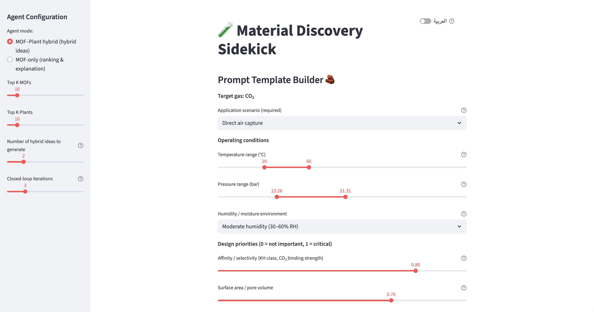
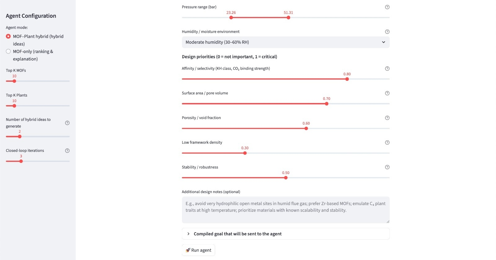
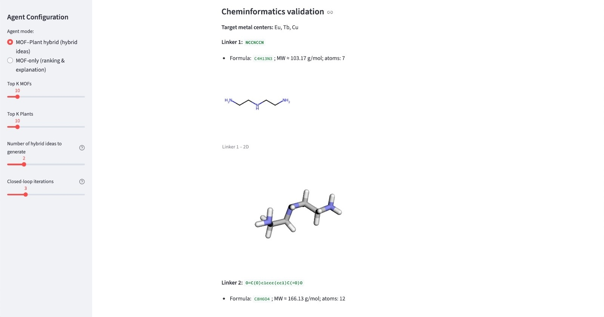
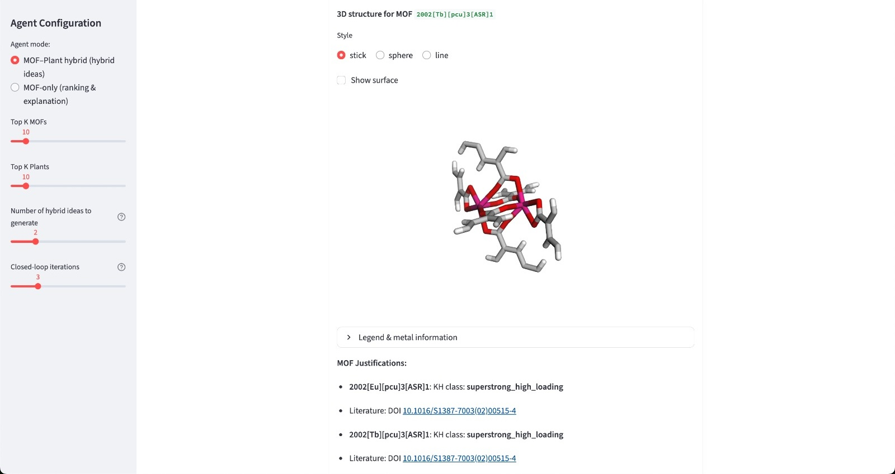
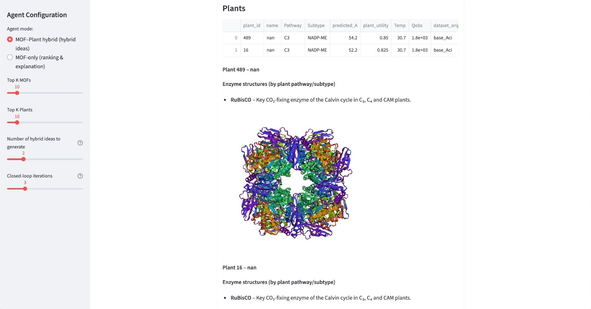
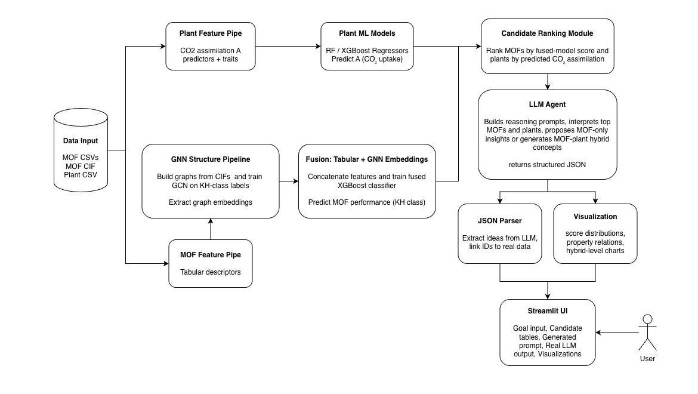

# Material Discovery Sidekick  
### AI-Driven MOF + Plant Hybrid Material Generator for CO₂ Capture  

  
*Figure 1: Streamlit interface of the Material Discovery Sidekick.*

---

  
  
  
  


---

# Installation

### 1. Clone repo  
```bash
git clone https://github.com/farah-alshiha/material-discovery-sidekick.git
cd material-discovery-sidekick
```
### 2. Setup environment
```bash
python3 -m venv venv
source venv/bin/activate
pip install -r requirements.txt
```
### 3. Run
```bash
streamlit run ui_app.py
```

---

# Material Discovery Sidekick

The **Material Discovery Sidekick** is a bilingual (English/Arabic) AI platform that unifies:

- Graph Neural Networks for MOF embedding  
- Machine Learning for plant CO₂ assimilation prediction  
- Generative LLMs for hybrid MOF design  
- Cheminformatics validation (RDKit, py3Dmol, PDB enzymes)  
- Streamlit UI with 3D visualizations  

This platform accelerates discovery of hybrid plant-inspired CO₂ sorbents by **10–20×**.

---

# Screenshots

### 1. Goal Builder (English Mode)

*Figure 2: User input environment conditions.*

### 2. Hybrid MOF Generation

*Figure 3: 3D visual of generated hybrid MOF linker and metal with legend*

### 3. 3D MOF CIF Viewer  

*Figure 4: 3D visual of MOF inspiration with associated literature (DOI)*

### 4. Plant Enzyme Viewer (PDB)

*Figure 5: 3D visual of plant enzyme inspiring the generated hybrid MOF*

---

# Objectives

- Combine plant physiological traits (C3, C4, CAM) with MOF properties  
- Build an AI engine capable of designing hybrid CO₂ sorbents  
- Score, rank, and visualize MOFs using GNN embeddings  
- Validate linker chemistry and protein–MOF inspiration pathways  
- Create a bilingual UI with Arabic support  

---

# Model Pipeline


*Figure 5: end-to-end pipeline*


---

# Features

### MOF Engine
- GNN embeddings from CIF structures  
- XGBoost fusion model for KH class + score  
- Full 3D visualization with py3Dmol  
- Automatic DOI-based justification  

### Plant Engine
- C3 / C4 / CAM datasets merged from multiple sources  
- Predicted CO₂ assimilation rate A  
- Scenario-specific ranking (temperature, humidity)  
- Enzyme mappings with local **pdb/** folder  

### Hybrid Generator
- LLM synthesizes plant–MOF-inspired hybrids  
- Automatically generates:
  - hybrid conceptual design  
  - key features  
  - regeneration/release strategy  
  - MOF & plant justifications  
  - optional Arabic explanation  

### Cheminformatics
- RDKit validation of proposed linkers  
- 2D + 3D ligand rendering  
- SMILES error detection  
- Protein structure loading (Rubisco, PEPC, PPDK, etc.)

### Bilingual UI
- Arabic translation of:
  - all labels  
  - explanations  
  - scenario builder  
  - LLM-generated hybrid reasoning  
- Right-to-left alignment for Arabic  
- Tables adjusted to avoid number truncation  
